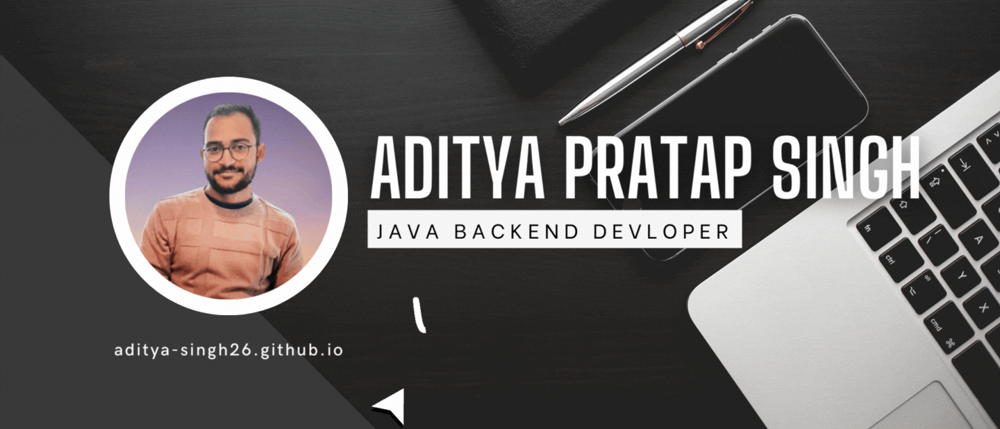

  

  

<h3 align="center">A passionate Backend Developer with proficiency in Core Java, JPA Hibernate and Spring Boot. Looking forward to applying and enhancing my skills and knowledge as a backend developer through challenging and exciting opportunities.</h3>

- 🔭 I’m currently working on **Online Cab Booking Application**

- 🌱 I’m currently learning **Swagger,AWS**

- 📫 How to reach me **adityapratap.singh43@gmail.com**

<h3 align="left">Connect with me:</h3>

<!----------------------------------- Tech Stack Section ------------------------------------>

<h3 align="left">Languages and Tools:</h3>

         

 

 

   
